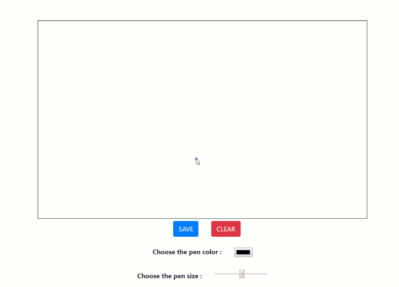

# PLAY-WITH-DRAWING 
---
#### This project is a simple white board for drawing then save your picture in the ``` images ``` folders .. 
#### All kids will have a fun time with this project ...

## What technologies that i used ?
 - Apache 2.4.35
 - Php 7.2.10
 - JavaScript
 - Ajax ( with jQuery -CDN- )
 - HTML 5 ( CANVAS )
 - SweetAlert ( CDN )
 - Some Style with CSS & Bootstrap ( CDN )


## Setup prerequists
 - you have to install dev-server like XAMPP , EASYPHP , WAMP or clone my [dev-server](https://github.com/3imed-jaberi/dev-server) .. 


## How to run the application
 - Clone this project.
 - Put this project in WORKSPACES folder of the dev-server. 
 - Make Sur the ``` GLOBALE_URL ``` variable in js script is correct.
 - Open browser then enter with localhost to project folder.
 
## Demo 

  
#### License
---
[MIT](https://choosealicense.com/licenses/mit/)  

